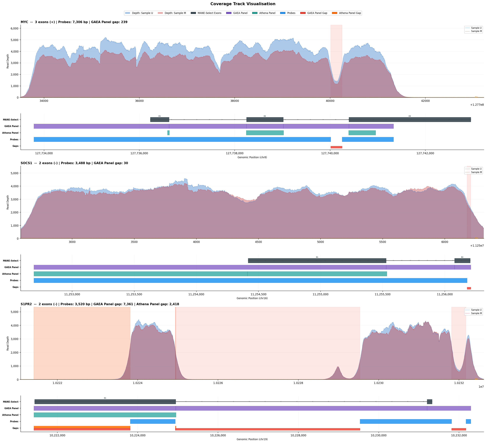

#ProbeScope

A command-line tool for generating per-gene coverage track plots from BAM files, overlaid on panel target BED annotations with MANE-Select exon models.

Designed for comparing probe design BED files against panel target definitions to identify coverage gaps, and verifying those gaps against real sequencing data.

## Features

- **Multi-sample BAM overlay** - visualise depth from multiple samples side-by-side
- **Multi-panel comparison** - compare multiple target BED files against a single probe design
- **MANE-Select gene models** - exon/intron structure fetched automatically from UCSC (no local database required)
- **Gap detection** - automatically identifies target regions not covered by probes
- **Flexible BED support** - handles 4-column and 6-column BED formats, with or without `chr` prefix

## Installation

```bash
pip install -r requirements.txt
```

**Dependencies:** `bamnostic`, `pandas`, `numpy`, `matplotlib`

**No reference genome or annotation database is needed.** MANE-Select exon coordinates are fetched from the [UCSC Genome Browser API](https://api.genome.ucsc.edu/) on first use and cached locally as a JSON file for subsequent runs.

## Usage

### Basic - one BAM, one target panel

```bash
python probescope.py \
  --bams sample.bam \
  --probes probe_design.bed \
  --targets panel_targets.bed \
  --output results/
```

### Two samples, two target panels, custom labels

```bash
python probescope.py \
  --bams sample1.bam sample2.bam \
  --bam-labels "Sample A" "Sample B" \
  --probes CAM_Lymphoma_probes.bed \
  --targets gaea_panel.bed athena_panel.bed \
  --target-labels "GAEA Panel" "Athena Panel" \
  --output results/
```

### Specific genes only

```bash
python probescope.py \
  --bams sample.bam \
  --probes probes.bed \
  --targets targets.bed \
  --genes TP53 MYC BCL2 SOCS1
```

### All genes (not just those with gaps)

```bash
python probescope.py \
  --bams sample.bam \
  --probes probes.bed \
  --targets targets.bed \
  --all-genes
```

## Arguments

| Argument | Required | Description |
|---|---|---|
| `--bams` | Yes | One or more BAM files (`.bai` index must exist alongside) |
| `--bam-labels` | No | Display names for BAM samples (default: derived from filename) |
| `--probes` | Yes | Probe design BED file (the regions your assay physically targets) |
| `--targets` | Yes | One or more panel target BED files to compare against probes |
| `--target-labels` | No | Display names for target panels (default: derived from filename) |
| `--genes` | No | Specific gene names to plot (default: all genes with gaps) |
| `--all-genes` | No | Plot every gene in the target BEDs, not just those with gaps |
| `--output`, `-o` | No | Output directory (default: `coverage_output/`) |
| `--mane-cache` | No | Path to MANE exon cache JSON (default: `<output>/mane_cache.json`) |
| `--per-page` | No | Number of genes per output image (default: 4) |
| `--dpi` | No | Output image resolution (default: 150) |

## BED file formats

ProbeScope accepts standard BED files in two formats:

**4-column** (probe designs, simple panels):
```
chr1    1787300    1787467    NM_002074.5
```

**6-column** (annotated panels with gene names and exon numbers):
```
1    1787325    1787457    NM_002074.5    GNB1    11
```

Chromosome names with or without `chr` prefix are handled automatically.

When a 4-column BED is used alongside a 6-column BED, gene names are mapped from the 6-column file via shared transcript IDs.

## Output

Each gene produces a two-panel figure:

- **Top panel**: Read depth from each BAM sample as filled coverage plots, with gap regions shaded and a 30x threshold line
- **Bottom panel**: Annotation tracks showing MANE-Select exon model, each target panel, probe regions, and gaps

Additionally, a `gap_summary.csv` file is produced with per-gene gap statistics.

## Example output



## How it works

1. Parses all BED files, normalising chromosome naming conventions
2. Computes gap regions (target regions not overlapping any probe region)
3. Fetches MANE-Select exon/intron structure from UCSC API (cached after first fetch)
4. For each gene, performs a single BAM index lookup per sample and builds a depth array from aligned reads
5. Renders coverage depth as filled area plots aligned with annotation tracks

## Notes

- BAM files must be coordinate-sorted and indexed (`.bai` file alongside the `.bam`)
- ProbeScope uses `bamnostic` (pure Python BAM reader), so no `samtools` or `htslib` installation is required
- Large loci (>50kb) are handled efficiently via a single-pass depth array approach
- The MANE cache file can be shared across runs to avoid repeated API calls
- Internet access is required on first run to fetch MANE-Select data; subsequent runs work offline if the cache exists

## License

MIT
